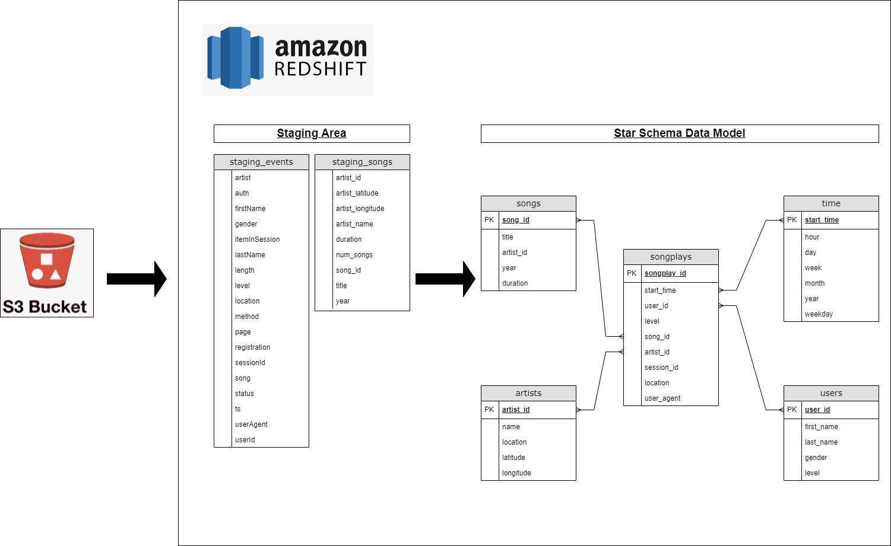

# Udacity Data Engineer Nanodegree - Project 3 Data Warehouse AWS Redshift

## Table of Contents
1. [Description](#description)
2. [Using the application](#getting_started)
	1. [Requirements to run project](#dependencies)
	2. [Installation](#installation)
	3. [ETL pipeline and schema design](#using)
	4. [Executing Program](#execution)    
3. [Acknowledgements](#acknowledgements)
4. [Authors](#authors)


<a name="descripton"></a>
## Description
This project makes use of data from a music streaming startup called Sparkify. Sparkify has grown their user base and want to move their data into the cloud. 

This project implements an ETL pipeline that extracts data from an S3 bucket in AWS, stages the data in Redshift and creates a star schema data model in Redshift to enable business users to analyse the Sparkify data.  


<a name="getting_started"></a>
## Using the application

<a name="dependencies"></a>
### Requirements to run project
* Python 3.7+
* Extracting configuration details: configparser
* Postgres SQL with Python: psycopg2
* Interacting with AWS resources using python: boto3

<a name="installation"></a>
### Installation
To clone the git repository:
```
git clone https://github.com/dirklambrechts/Data-Warehouse-with-Redshift
```

<a name="using"></a>
### ETL Pipeline and schema design:
The project is made up of four major steps: 

1. Create the tables required for staging the data from the S3 bucket and for the star schema data model
2. Extract the data from S3 bucket and stage it in the staging tables
3. Transform the data from the staging tables to a star schema data model
4. Load the data into the star schema data model tables



<a name="execution"></a>
### Executing Program:

1. Make use of the steps in the Jupyter notebook `etl_preparations.ipynb` to create the necessary IAM roles and to create a cluster in AWS Redshift. (To make use your own AWS account, change the details of KEY and SECRET in the `dwh.cfg` file)

2. One the cluster is created open the `dwh.cfg` file and fill out DWH_ENDPOINT, ARN and HOST to ensure that steps 3 and 4 have the correct config to run the table creation and ETL programs.

3. Run the following command to drop all existing tables and create new staging and star schema data model tables:
    
    `python create_tables.py`

4. Run the following command to perform etl process from staging tables to star schema data model tables:
    
    `python etl.py`

<a name="acknowledgements"></a>
## Acknowledgements
[Udacity](https://www.udacity.com/) for the project specifications.

<a name="authors"></a>
## Authors

* [Dirk Lambrechts](https://github.com/dirklambrechts)